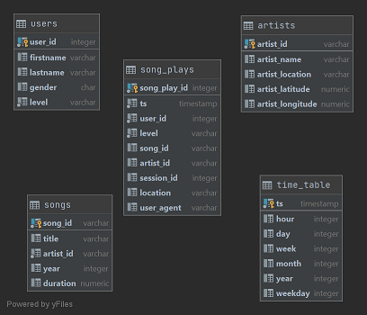

## PostgreSQL Data Modeling ETL
### Introduction
A music streaming app service company was seeking assistance seeking insights of their subscribers, 
artists and played songs contained in logs with JSON format. The logs files collected were for the month of November 2018. A systematized 
method to load the log files into database tables was developed. The tables will be used to 
answer queries about their service. 

### Methods
Automation of the ETL process was done through Python scripts. The scripts are described below

- sql_queries.py
  - Establishes the tables to be created within the database including 
      - data schema
      - primary key 
      - how to handle upserts
  - Drops the same tables to rerun process when running tests
  - Creates insert methods to be inserted in other files
      - Target columns from the table schema
      - Values taken from read per JSON files read per line
  - Creates query method to search for artists once tables are established
- create_tables.py
  - Creates the database to initiate the project
  - Runs the drop and create of tables in the database 
- etl.py
  - Production script used after first achieving data exploratory testing within `etl.ipynb` Jupyter Notebook 
  - Loads log files
  - Runs the SQL queries for each song or log file, respectively
  
### How to run the Python scripts
- Step 1: Run the `create_tables.py` file in order to drop the previous database or existing tables. This file imports
  the scripts from the file `sql_queries.py` to execute.
- Step 2: For verification of the ETL pipeline the `etl.ipynb` notebook file can be run after connecting to a Jupyter
  Notebook instance. To initiate, being within a conda environment, activate and launch the `jupyter notebook`. Connect
  to the server with the provided link and token to execute either cell by cell or as a continuous file, run all. Only
  select files are processed to verify the commands to manage the log files into the database. 
- Step 3: Run the `create_tables.py` to reset the database and tables
- Step 4: Run the `etl.py` file which imports the same SQL query scripts from `sql_queries.py` to recreate the database 
  for all .json files within folders.
- Step 5: SQL queries can now be executed from a SQL client like the ones below. 

### Results
The JSON files were parsed into different tables to make relational queries logical and manageable in a format 
that can emulate a star schema. The dimension tables of users, artists, songs and time can be used to create the
fact table of song plays. The normalized tables can provide the analysis needed to find most songs played (see Sample 
Queries section below) while the denormalized table of song play can be used for business analytics and end users. 

### Sample Queries
    
Below are sample queries and results for song play analysis.

#### Sample query of song plays where we have a song id or artist id:
    SELECT * FROM song_plays 
    WHERE artist_id 
    LIKE '%' or song_id LIKE '%';

 song_play_id |           ts            | user_id | level |      song_id       |     artist_id      | session_id |              location              |                                                                user_agent
--------------|-------------------------|---------|-------|--------------------|--------------------|------------|------------------------------------|-------------------------------------------------------------------------------------------------------------------------------------------
         4627 | 2018-11-21 13:56:47.796 |      15 | paid  | SOZCTXZ12AB0182364 | AR5KOSW1187FB35FF4 |        818 | Chicago-Naperville-Elgin, IL-IN-WI | "Mozilla/5.0 (X11; Linux x86_64) AppleWebKit/537.36 (KHTML, like Gecko) Ubuntu Chromium/36.0.1985.125 Chrome/36.0.1985.125 Safari/537.36"
(1 row)

#### Sample query identifying the top 10 users by count of streamed songs

    SELECT u.user_id, u.firstname, u.lastname, plays.tot_plays  
    FROM (SELECT user_id, count(*) tot_plays 
        FROM song_plays 
        GROUP BY user_id 
        ORDER BY tot_plays 
        DESC LIMIT 10) plays 
    INNER JOIN users u 
    ON plays.user_id=u.user_id 
    ORDER BY tot_plays DESC;

 user_id | firstname  | lastname  | tot_plays
---------|------------|-----------|-----------
      49 | Chloe      | Cuevas    |       689
      80 | Tegan      | Levine    |       665
      97 | Kate       | Harrell   |       557
      15 | Lily       | Koch      |       463
      44 | Aleena     | Kirby     |       397
      29 | Jacqueline | Lynch     |       346
      24 | Layla      | Griffin   |       321
      73 | Jacob      | Klein     |       289
      88 | Mohammad   | Rodriguez |       270
      36 | Matthew    | Jones     |       248

#### Sample query identifying the artists with the top streamed plays

    SELECT a.artist_id, a.artist_name, plays.tot_plays
        FROM (SELECT artist_id, count(*) tot_plays
            FROM song_plays
            GROUP BY artist_id
            ORDER BY tot_plays
            DESC LIMIT 10) plays
        INNER JOIN artists a
        ON plays.artist_id=a.artist_id
        ORDER BY tot_plays DESC;
     
artist_id      | artist_name | tot_plays
--------------------|-------------|-----------
 AR5KOSW1187FB35FF4 | Elena       |         1

### Conclusion
The analytics team was interested in understanding what songs users are listening to. However, the limited
data for the month of November 2018 only yielded one match for the song title, artist name and title in the 
steamed search. Unfortunately the songs played do not have many song ids and could only identify one in the dataset.